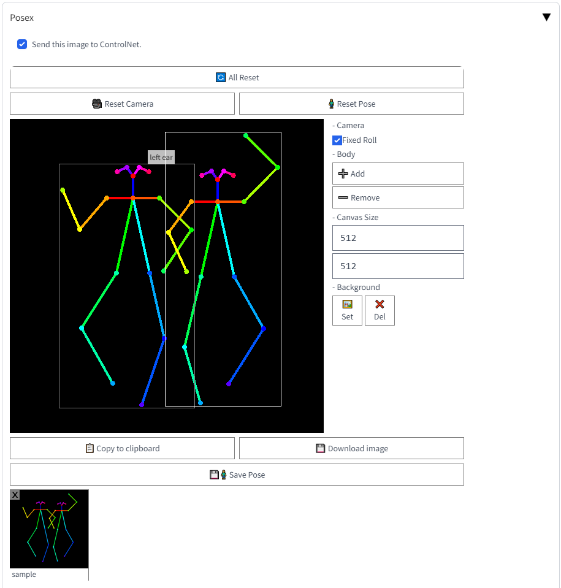

# Posex - Estimated Image Generator for Pose2Image


## Quick Start with [Web UI](https://github.com/AUTOMATIC1111/stable-diffusion-webui)

1. Install [Mikubill/sd-webui-controlnet](https://github.com/Mikubill/sd-webui-controlnet).
2. Install Posex (this).
3. Open `Posex` accordion in t2i tab (or i2i as you like). Enable `Send this image to ControlNet` checkbox. Editor will be appear.
4. Configure ControlNet as below.
```
Preprocessor: none
Model: control_sd15_openpose
```
5. Generate images.

## How to use

```
Click:      select body
Left Drag:  move joint (on joint)
            rotate camera (otherwise)
Right Drag: move whole body (if selected)
            move camera (otherwise)
Wheel:      zoom
```

## Installation

- [Web UI](https://github.com/AUTOMATIC1111/stable-diffusion-webui) Extension
- Online (Github Pages)
- Standalone

### [Web UI](https://github.com/AUTOMATIC1111/stable-diffusion-webui) Extension

**Prerequirement: You need to install [Mikubill/sd-webui-controlnet](https://github.com/Mikubill/sd-webui-controlnet) to use Posex with ControlNet Pose2Img.**

Go to `Extensions` tab, then select `Install from URL` tab and input `https://github.com/hnmr293/posex`.

Or move to `extensions` directory and type `git clone https://github.com/hnmr293/posex`.

In webui, open `Posex` accordion in `txt2img` or `img2img` tab, then click a checkbox. The canvas will be opened.

### Online

See Github Pages.

[https://hnmr293.github.io/posex](https://hnmr293.github.io/posex)

### Standalone

```
$ pip install -r requirements.txt
$ python app.py
```

Then open `localhost:55502` or `127.0.0.1:55502` in your browser.

## Example

### Web UI



result:


### Standalone


## History

### v0.2 -> v0.3 features
- Web UI extension

### v0.1 -> v0.2 features
- copying the image to clipboard
- multiple bodies
- canvas size changing
- UI has become ugly >_<;
